# Qualité de développement

Le but de ce cours est de faire des tests tests unitaires et d'intégration au fur et à mesure que des nouveaux composants sont intégrés dans une apllication tout en vérifiant que les tests précédents continuent de passer sans relever d'erreur. 

On appelle cela des tests de non regression.

## Support de cours

https://drive.google.com/drive/folders/1RVLc4yg5IKTq3OSht6wm1Cdjq9jOLEqy?usp=sharing


>**Ressource de M. LEMAIRE:**
>
> * [Introduction au cours de qualité de développement](https://e.pcloud.link/publink/show?code=XZRFxPZxa6jVeLys40yTU3p3RaEzXaheXuk=)
>
> * Support de cours concernant Git
>   * [Support de cours sur Git](https://e.pcloud.link/publink/show?code=XZT45CZgsA2bvsKBefHmVhdgo3G9mlfDa3y)
>   * [Création d'un dépôt Git](https://e.pcloud.link/publink/show?code=XZ3qthZaMGfUQCtTUR1zXO0O5jqnQVf5lQX)


# TD 1 - JUnit

JUnit est un framework de tests unitaires pour le langage de programmation Java, créé par Kent Beck et Erich Gamma.

Etudier un exemple de classe de Test : https://junit.org/junit5/docs/current/user-guide/#writing-tests

Etudier l'utilisation des assertions : https://junit.org/junit5/docs/current/user-guide/#writing-tests-assertions


>**Ressource de M. LEMAIRE:**
>
>[Tests unitaires avec JUNIT](https://e.pcloud.link/publink/show?code=XZc4tPZdNNzQHJT3vLYNlEYQGR70JHMaPj7)


# TP 1 :  JUnit, développent et tests unitaires de la classe métier

## Création du projet

* Tests unitaires avec JUNIT

1. Créer un projet avec Intellij :


Attendre que le projet soit créé.

2. Mise en place du framewok pour les tests unitaires 

2.1. Ajouter la librairie Jupiter (clic droit sur le projet -> Open Module Settings) : 


2.2. Configuration du projet

* Ajouter dans le dossier `src` deux dossiers (java pour les *classes à tester* et test pour les *classes de test*).

* Indiquer à Intellij que java est le dossier pour le code source et test celui pour les tests.


3. Commençons le développement

3.1. En ce qui concerne la classe métier  `Voiture`

* Créer une classe `Voiture` dans le packe de `src/main/java`

> Les caractéristiques de d'une *voiture* sont la *marque* (`String`) et le *prix* (`Float`) et une plaque d'imatriculation sous la forme `XXXYYZZ` où :
> * `XXX` sont trois chiffres,
> * `YY` sont deux lettes en majuscules,
> * `ZZ`sont deux chiffres.

Toute anomalie sera signalée par une `RunTimeException` de type `IllegalStateException`.

3.2. En ce qui concerne la classe de test pour la clasee métier `Voiture`

* Créer une classe `VoitureTest` dans le package de `src/test/java` et écrivez le code de test de la classe Voiture en utilisant le framework JUnit 5

> Le but est de tester l'interface publique de la classe métier `Voiture` et de vérifier que l'objet est dans un état valide.

Lancer le programme de test (clic droit sur la classe de test)

> Tous les tests doivent passer (*être vert*)


**Faisons le point :**  Au début de cette partie vous avez écrits et fait passé tout vos tests unitaires
  
Quelques exemples de tests unitaires : 

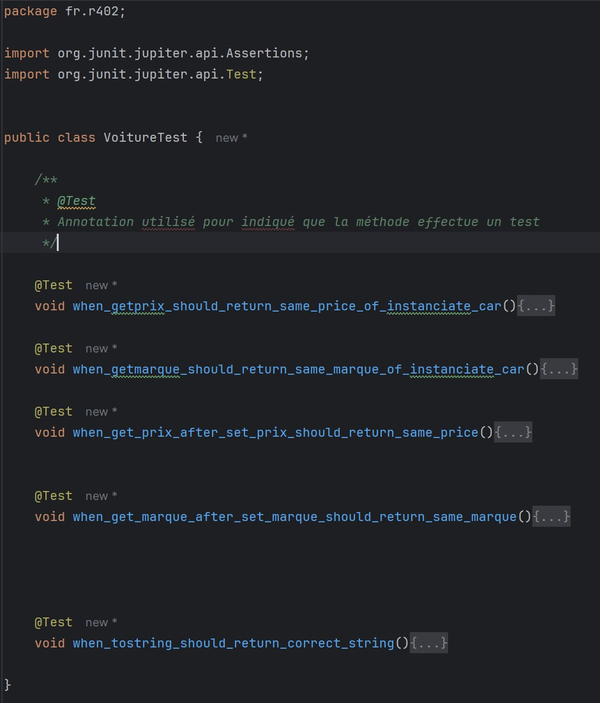


---

---


# TP2 : Intégration continue, développement et tests unitaires de la classe service

Nous allons développer une application Web en utilisant le framework SpringBoot pour faciliter le développement et les tests.

* Voici quelques ressources utiles pour ce travail pratiques :
  * **Ressources de M. LEMAIRE:**
    * [Arborescence du projet SpringBoot](https://einfo-learning.fr/moodle/mod/page/view.php?id=12840)
    * [Une application d'entreprise](https://e.pcloud.link/publink/show?code=XZDX0SZj25tahv9IL7yo7IbOIzr04Vdqjl7)


Cloner le dépôt git suivant qui vous servira de point de dépat pour cette partie du travail pratique :

https://github.com/bouchaiblemaire/r402_2025_qual_dev_springboot.git

**Remarque :** Ce projet contient une correction de la classe métier `Voiture`et de la classe de tests `VoitureTest`.


**A lire jusqu'au bout AVANT DE COMMENCER !**

## **Préparaton de votre dépôt git pour mettre en place l'intégration continue**
### Etape 1 : Appropriation du projet

Vous devez vous appropier ce projet, c'est-à-dire que **vous devez le déplacer vers un dépôt Git vous appartenant**.


## **Voici quelques indications :**

1. Créer votre dépôt distant

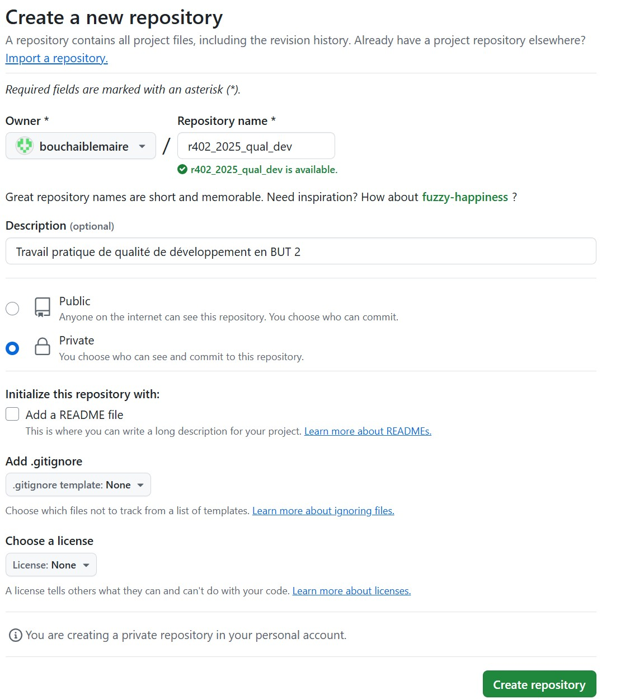

**Notes :**
* Le dépôt doit-être privée dans le cadre de ce travail pratique.
* Le dépôt doit-être vide car nous allons l'initialiser avec notre dépôt local
    * ne pas cocher `Add a README file`
    * ne pas ajouter de fichier `.gitignore`
   
2. Déplacez-vous dans le dossier contenant votre projet sur votre machine

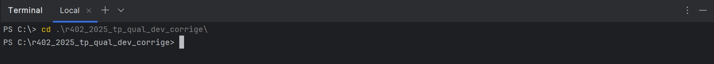

**Note :** Nom du dossier à adapter avec le nom réel de votre dossier local contenant le projet.

3. Initialiser votre dépôt distant avec votre dépôt local (ici c'est un exemple avec **mon** dépôt distant !)

```
git init
git add .
git commit -m "first commit"
git branch -M main
git remote add origin https://github.com/bouchaiblemaire/r402_2025_qual_dev.git
git push -u origin main
```

Si nécessaire supprimer le lien avec l'origine existante : 
```
git remote remove origin
```

et refaire le `git add remote`.

**Affichage obtenu avec mon dépôt :**

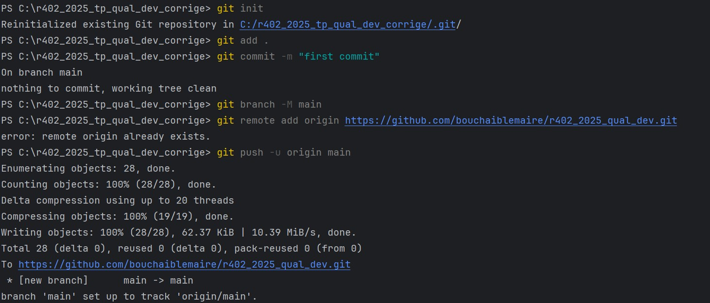

4. Inscrivez votre enseignant comme *participant* de votre projet github.


**A ce point vous disposez de votre dépôt github correctement initialisé.**


### Etape 2 : Vous allez vous mettre dans la peau d'un chef de projet et mettre en place les outils pour l'intégration continue


---

---


**Le principe :**

**A LIRE JUSQU'AU BOUT !**


**Cette partie vous exlique le principe global du mécanisme d'intégration continue en se basant sur un scénario :**

* Quand un développeur apporte une modification au code il faut tester que son code n'est pas buggé et qu'il ne provoque pas d'erreur dans le code existant (test de non regression du code).

**Règle :** Pour ne pas corrompre le code existant, **toutes modifications doit se faire dans une branche git**.

* Quand la modification est terminée et que les tests sont validés, le développeur va pousser sa branche vers le serveur distant Git et à ce moment-là les tests (de son code et du code déjà écrit) doivent être déclenchés **automatiquement côté serveur** :
    * Si les tests réussissent, le chef de projet (ou une personne autorisée) pourra alors fusionner les branches et les autres développeurs pourront alors télécharger la dernière version du code.
  
> Cette procédure qui part de l'initiative du développeur et qui se termine par la fusion des branches par le chef de projet si les tests réussissent est appelée *pull request*.

### Comment les tests sont automatisées côté serveur ? 

#### Github actions

Côté serveur, Github peut exécuter des tâches automatiquement comme lancer les tests. Pour cela **il faut configurer une action**.


### **Maintenant on va détailler plus précisemment les étapes précédentes avec les commandes qui sont exécutées**

#### **En ce qui concerne un développeur de l'équipe de projet**

Quand un développeur collabore à un projet il procède de la façon suivante : 

1. le développeur récupère le projet sur sa machine (`git clone`)
    * Il crée un dépot local dans sa machine
  

**Remarques :** 
* Pour ce travail pratique vous disposez déjà du dépôt local ! 
* Vous pouvez jouer le rôle d'un nouveau développeur à clonant le dépôt distant dans un autre dossier de votre machine locale.

2. le développeur créé une copie du projet (eq. une branche) afin de ne pas affecter le code qui est déjà en production (`git branch` et `git checkout`)

Exemple :

```
git branch nouvelle_fonctionnalite
git checkout nouvelle_fonctionnalite
```

ou en une seule commande :
```
git checkout -b nouvelle_fonctionnalite
```

**Note :** Vous le ferez dans la partie *développement de la couche service*


* Toutes modifications se font sur une branche et n'altère pas le projet principal (branche `main`)

3. Le développeur travaille à débogger le code ou à développer une nouvelle fonctionnalité (`git add`, `git commit`)
    * Dans cette étape, **toutes les modifications se font dans la branche locale**.
  
4. Le développeur écrit aussi les programmes de tests qui valident son travail
   
5. Et enfin le développeur envoie sa copie du code vers le serveur distant git pour partager ses midifications/ajouts (`git push`)


#### **En ce qui concerne le chef de projet**

Le chef de projet peut alors déclencher un processus d'**intégration continue** (CI) en lançant les procédures de tests écrit par le développeur :
> c'est le pull request. Un script va alors être déclanché sur un serveur de test. 

Si les tests du développeurs sont concluants, le chef de projet peut alors décider de fusionner la copie du développeur avec la version originale (`git merge`).
* Tous les développeurs doivent alors récupérer la mise à jour du code sur leur machine en faisant un `git pull`

Et c'est là qu'on comprend le terme *pull request* qui est finalament une demande de pull faite par un développeur au chef de projet quand il a finit son travail.

**En conclusion :** Dès lors que le code est testé sur les serveurs de github, le code est disponible auprès des autres développeurs de l'équipe.

---

---


## **Travail à faire**

**Objectifs :**

Nous allons mettre en pratique le mécanisme d'intégration continue selon 2 scénarios :

* **Partie 1 :** Les membres de l'équipe ont pu développer la classe `StatistiqueImpl`
* **Partie 2 :** Les membres de l'équipe n'ont pas encore  développé la classe `StatistiqueImpl`
  
Dans les deux cas où il faut réaliser les tests de la classe `StatistiqueImpl`.

La question que vous pouvez vous poser dès à présent, concerne la *partie 2*...

> *Comment écrire des tests sur une classe qui n'a pas encore été écrite ?*<br>
> C'est là que le framework *Mockito* va jouer un rôle important !


---

### **Travail à faire par le chef de projet,  mise en place du processus d'intégration continue**

1. Connectez-vous sur votre dépôt distant en utilisant l'interface Web de Github et cliquez sur le bouton `Actions`

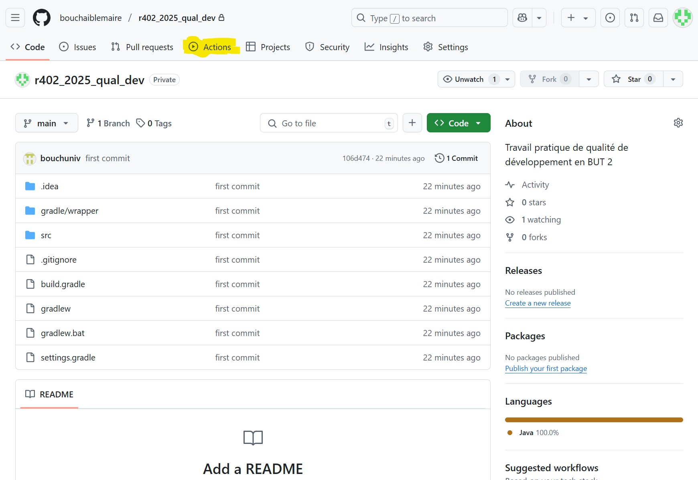

2. Cliquez sur le bouton configure de la tuile `Java with Gradle`

**Note :** Prendre soin de bien lire les informations qui sont affichées !

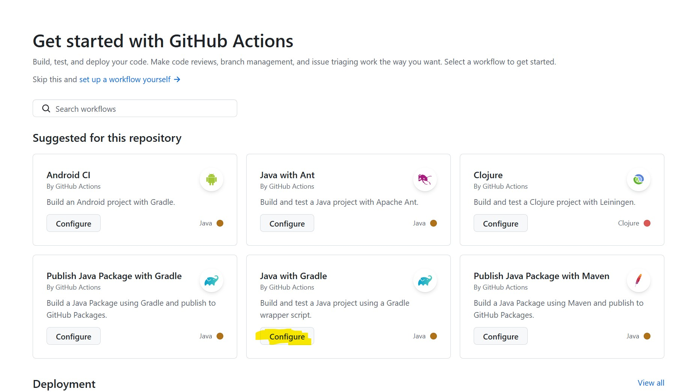

**Lisez et interprétez les informations qui sont affichées dans le script affiché !**

Cliquez sur le bouton `Commit changes`

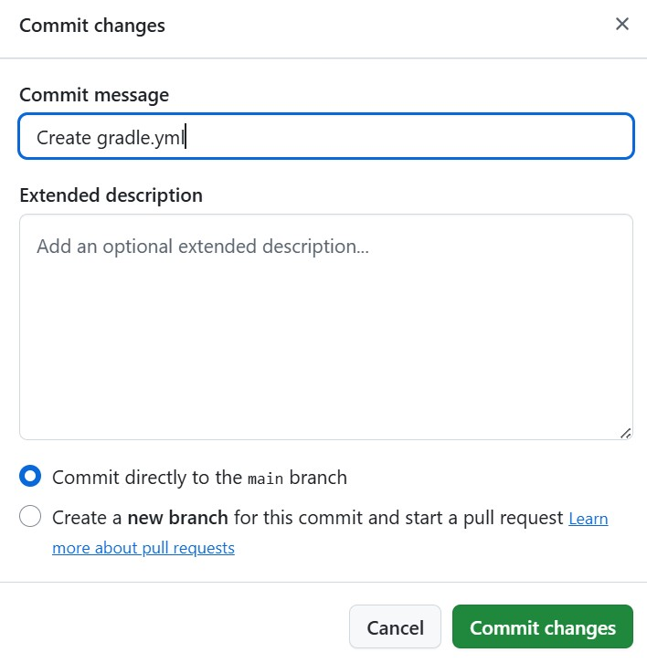


* Votre *action* est mis en place et est lancé 
  * c'est à dire que tous les tests seront automatiquement lancé à chaque demande de *pull request* ! 
* Soyez patient et interpréter les résultats et corriger les erreurs eventuelles.
    * Pour cela cliquez sur le lien du *workflow* affichée

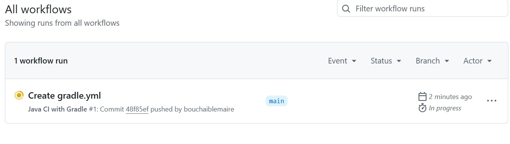

*Indices sur quelques solutions pour corriger certaines erreurs éventuelles :*
* Activez les *dépendances de graphes* dans la paramètres avancées de votre dépot git distant.
* Donnez les droits d'execution au script `gradelew` et mettre à jour le dépôt distant.

Dans l'exemple suivant, l'erreur de droit d'exécution sur le fichier `gradlew` a été corrigé et une autre demande de pull request a été effectuée :
* Le chef de projet à effacé le premier workflow pour garder ke deuxime
  
  
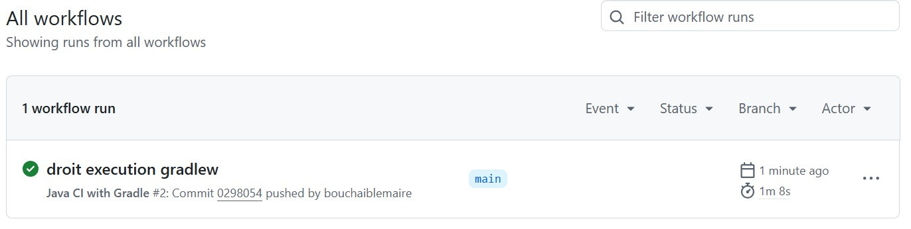

A ce point du travail pratique le `workflow`doit s'exécuter sans erreur et **tous les indicateurs doivent être vert**.


---


### **Travail à faire par le développeur**

Vous disposez des interfaces et classes suivantes : 

* Classe `Echantillon`
```java
package com.example.springbootest.service;

/**
 * Classe de données qui permet d'encpsulée de données
 *   * Nombre de voitures
 *   * Prix moyen de ce nombre de voiture(s)
 */
public class Echantillon {

    int nombreDeVoitures;
    int prixMoyen;

    public Echantillon(){}

    public Echantillon(int nombreDeVoitures, int prixMoyen) {
        this.nombreDeVoitures = nombreDeVoitures;
        this.prixMoyen = prixMoyen;
    }

    public int getNombreDeVoitures() {
        return nombreDeVoitures;
    }

    public void setNombreDeVoitures(int nombreDeVoitures) {
        this.nombreDeVoitures = nombreDeVoitures;
    }

    public int getPrixMoyen() {
        return prixMoyen;
    }

    public void setPrixMoyen(int prixMoyen) {
        this.prixMoyen = prixMoyen;
    }
}
```

**A faire :** Ajouter la méthode `equals` en vous aidant de l'IDE IntelliJ

* Interface `Statistique`


```java
package com.example.springbootest.service;
import com.example.springbootest.data.Voiture;

public interface Statistique {

    public void ajouter(Voiture voiture);

    public Echantillon prixMoyen() throws ArithmeticException;

}
```

* La classe `StatistiqueImpl` qui implémente l'interface `Statistique` :

```java
package com.example.demo.service;

import com.example.demo.data.Voiture;
import org.springframework.stereotype.Service;

import java.util.ArrayList;
import java.util.Iterator;
import java.util.List;

@Service
public class StatistiqueImpl implements Statistique{

    List<Voiture> voitures = new ArrayList<Voiture>();

    @Override
    public void ajouter(Voiture voiture) {
        voitures.add(voiture);
    }

    @Override
    public Echantillon prixMoyen() throws ArithmeticException {
        int prixTotal = 0;
        int nombreDeVoitures = 0;
        Iterator<Voiture> iterator = voitures.iterator();
        while(iterator.hasNext()){
            prixTotal = prixTotal + iterator.next().getPrix();
            nombreDeVoitures++;
        }
        return new Echantillon(nombreDeVoitures, prixTotal/nombreDeVoitures);
    }
}
```
**Important !** Le code Java précdent est un exemple d'implémentation pour vous aider à comprende l'interface publique (les services rendus) par une classe qui implémente l'interface `Statistique`!


**A lire jusqu'au bout AVANT DE COMMENCER !**


---

#### **Partie 1 : Travail à faire par le développeur**

On se situe dans le scénario de **partie 1** où toutes les classes ont été développées et où il s'agit d'écrire la classe de tests.

**Principale étapes**
1. Dessiner le diagramme de classe de l'application
2. Créer une branche `newcarservicempl` et  écrire les tests de la classe `Statistique`.
3. Faire passer les tests.
4. Faire un *pull request* mais vous prendrez soin de ne pas effacer cette branche lorsque que le chef de projet aura acceptée votre demande de *pull request* (pour la garder à des fins de révisions).


---

**A vous de jouer :**

1. Créer une nouvelle branche sur votre machine locale:
```
git branch newcarservicempl
```
2. Se déplacer vers la nouvelle branche:
```
git checkout newcarservicempl
```
3. Ajouter les fonctionnalités de la couche service et écrire les tests unitaires associés
   
4. Faire passer tous les tests, ils doivent être tous vert.
   
5. Mettre à jour le dépôt local en *committant* les modifications :
```
git add .
git commit -a -m "newcarservicempl"
```
1. Se remettre sur la branche `main` de votre dépôt local
```
git checkout main
```
1. Envoyer les changements vers GitHub :
```
git push -u origin newcarservicempl
```

**Remarque :** Une demande de *pull request* sera ouverte automatiquement.


### **Ce que doit faire le chef de projet :**

1. Traiter la demande de *pull request*

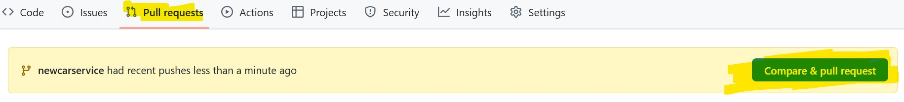

2. Vérifier que la fusion est possible :

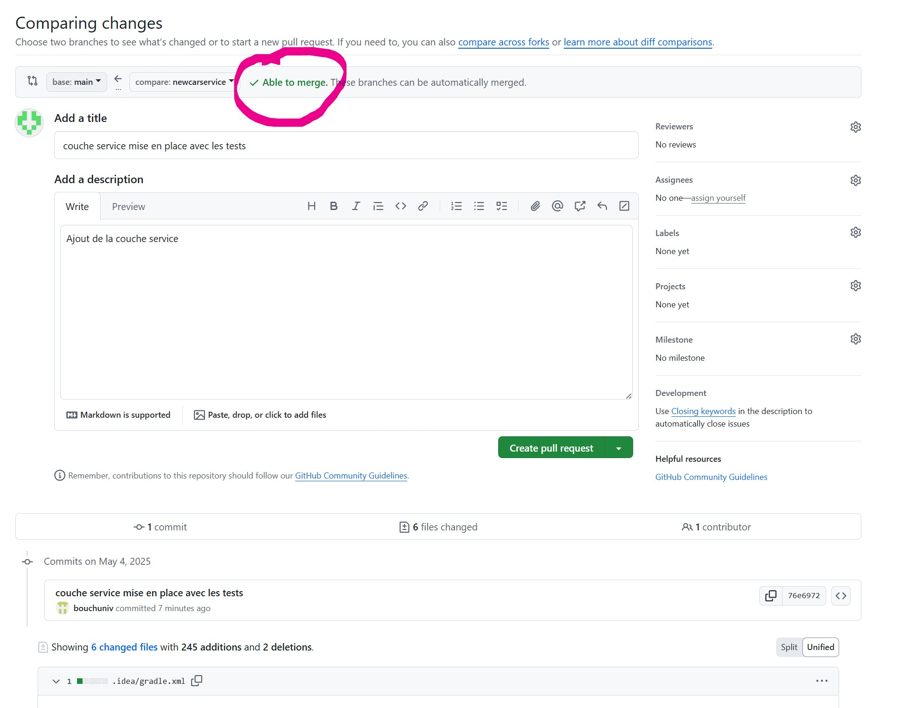

3. Créer la demande de *pull request*
   
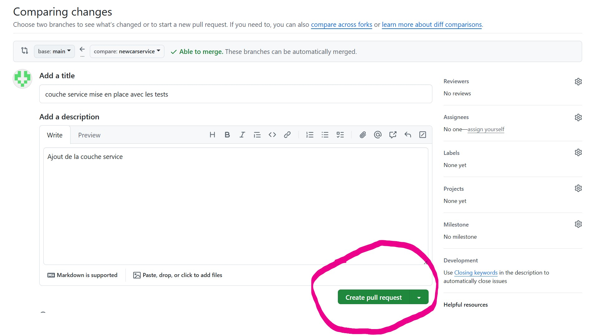

4. Vérifier que tous les tests automatisés passent avant d'accepter de fusionner la branche `newcarservice`avec la branche `main`
  * Tous les indicateurs doivent être au vert


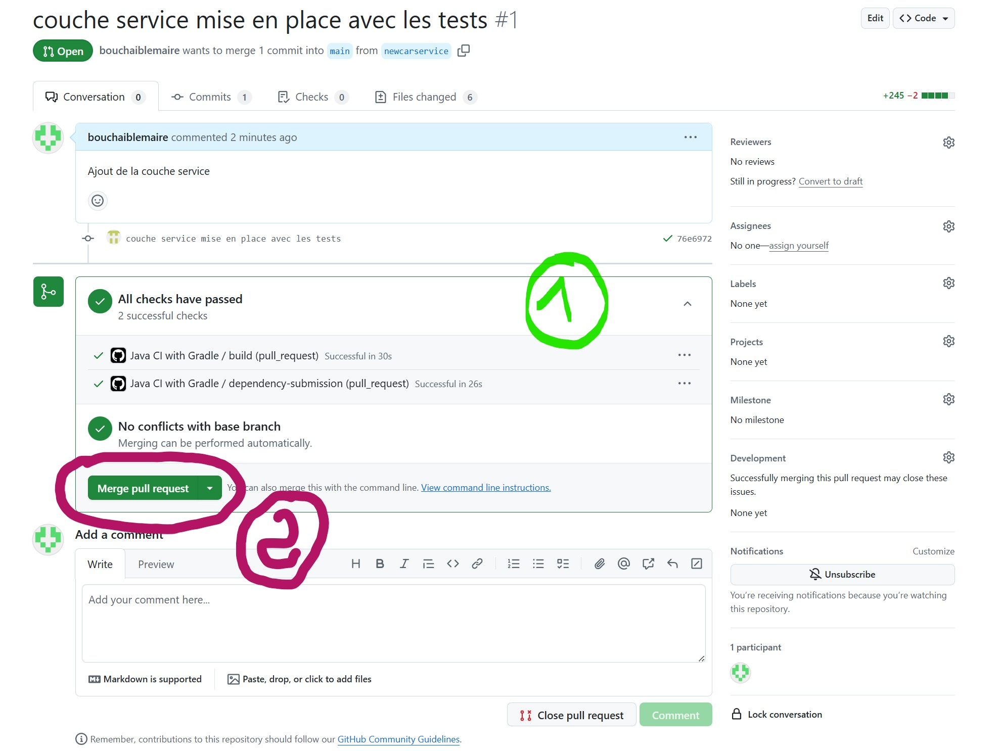


**Après traitement de la demande de pull request**

La nouvelle branche peut alors être effacée sur la machine du développeur et celle qui est chez Github :

```
git branch -D newcarservicempl
```
```
git push origin --delete newcarservicempl
```

**Notes :** Ne pas le faire dans le cadre de ce travail pratique à des fins de révisions.

**3. Ce que doit faire le développeur**

Mettre à jour sa branche `main`

```
git pull
```


---

#### **Partie 2 : Travail à faire par le développeur**


On se situe dans le scénario de **partie 2** où les développeurs n'ont pas encore développer la classe `StatistiqueImpl`.

* Voici quelques ressources utiles pour ce travail pratiques :
  * Etude du framework de test Mockito: https://github.com/charroux/mockito
  * **Ressources de M. LEMAIRE:**
    * [Mockito à la rescousse](https://e.pcloud.link/publink/show?code=XZHV0SZOWRt6RzqwhYaIsO1PCJEJykUpGpy)
    * [Injection de dépendances](https://e.pcloud.link/publink/show?code=XZIc0SZaw1WrAlskWF7Te1aLf24Yf1w8H1y)
  * **Autres ressources :**
    * [Comprendre les annotations dans Spring Boot : guide et exemples](https://www.sfeir.dev/back/comprendre-les-annotations-dans-spring-boot/)


**Votre tâche consiste à écrire la classe de test en utilisant le framework Mockito**

* Voici quelques ressources utiles pour ce travail pratiques :
  * Etude du framework de test Mockito: https://github.com/charroux/mockito

**Mais pourquoi faisons nous cela ?**

La classe qui implémente l'interface `Statistique` utilise une `ArrayList` pour implémenter l'ensemble des voitures (agragation en UML entre la l'interface et la classe data `Voiture).
> * Cependant on aurait pu utiliser un tableau voire une base de donnée.<br>
> * On pourrait aussi **ne pas disposer de l'implémentation de cet ensemble de voitures mais quand même vouloir mener à bien les tests unitaires** de la classe service `Statistique`.

**Alors comment faire ?**

Pour cela on va **simuler l'implémentation** de la classe service `StatistiqueImpl` en utilisant le framework *Mockito* et en se basant sur **son interface publique** (eq. les méthodes pupliques)


Mockito va faire passer les tests en simulant les services que devrait rendre la classe `StatistiqueImpl` !


*Sur quoi se base Mockito pour faire sa simulation ?*

>Mockito va s'appuyer sur l'interface `Statistique` pour connaître :
>* Les opérations à simuler pour faire passer les tests
>* Ce qui est attendu.


**Voici une ébauche  de la classe de tests :**

```java
package com.example.springbootest.service;

import org.springframework.boot.test.context.SpringBootTest;
import org.springframework.boot.test.mock.mockito.MockBean;

@SpringBootTest
public class StatistiqueTest {
    @MockBean   // <----  indique que mockStatistique est un mock qui va simuler les opérations de l'interface Statistique
    Statistique mockStatistique;

    @Test
    public void un_exemple_de_test(){
      // Arrange
      // On programme la simulation

      // Act
      // On lance les services à tester


      // Assert
      // On valide les tests


    }

    
}

```
En suivant la même démarche que la **partie 1** pour la mise la préparation de votre environnement de développement ; écrire la classe de tests en utilisant le framework Mockito pour simuler le comportement des opérations attendues par l'interface `Statistique`.

**Principale étapes**
1. Dessiner le diagramme de classe de l'application
2. Créer une branche `newcarservicemockito` et  écrire les tests de la classe `Statistique`.
3. Faire passer les tests.
4. Faire un *pull request* mais vous prendrez soin de ne pas effacer cette branche lorsque que le chef de projet aura acceptée votre demande de *pull request* (pour la garder à des fins de révisions).

# TP 3 : Développement et tests du service Web

L'application est utilisé comme un service Web.

Le code du contrôleur est donnée ci-desssous :

```java

```

L'application de la question précédente est utilisé la un service Web dont voici le code : https://github.com/charroux/testsLogiciel/blob/main/src/main/java/com/example/demo/web/StatistiqueController.java

Votre travail consiste à écrire la classe de test correspondante : https://github.com/charroux/testsLogiciel/blob/main/src/test/java/com/example/demo/web/WebTests.java

# TP 4

## Tests de couverture de code

Le script d'intégration coninue qui s'exécute chez Github contient déjà un programme de couverture de code (voir à la fin l'instruction ./gradlew jacocoTestReport) : https://github.com/charroux/testsLogiciel/blob/main/.github/workflows/action.yml

Vérifiez que votre script conient cette instruction et ajoutez-là si ce n'est pas le cas. 

Gradle (l'outil de compilation) requiert un plugin pour générer le rappprt de converture de code. 
Ce plugin doit être indiqué par l'instruction (id 'org.barfuin.gradle.jacocolog' version '1.0.1') dans le fichier de configuration du projet (en ligne 6) : https://github.com/charroux/testsLogiciel/blob/main/build.gradle

Quand le script d'intégration continue s'exécute le rapport généré contient les résultats de la couverture de code :


Ce rapport n'est pas très détaillé et donc pas très facile à exploiter ! Cependant, il est suffisant pour vous rendre compte si vos programmes de tests garantissent une bonne couverture de code. Si ce n'est pas le cas, à vous d'ajouter des cas de tests pour améliorer la couverture de code.
Si vous souhaitez avec un rapport de couverture de code plus détaillé, vous pouvez lancer le test de couverture sur votre machine via : 

```
./gradlew jacocoTestReport
```

Mais encore faut-il que votre machine dispose de Java JDK 17.